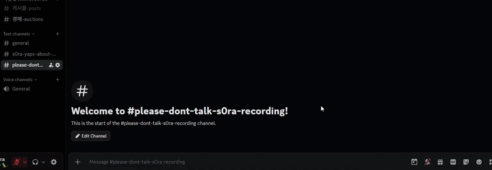
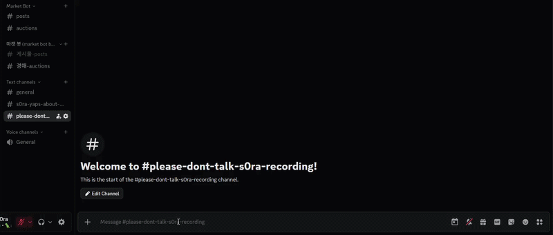
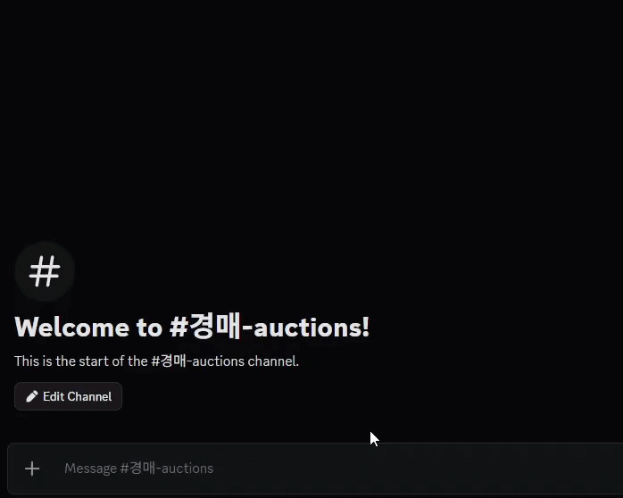
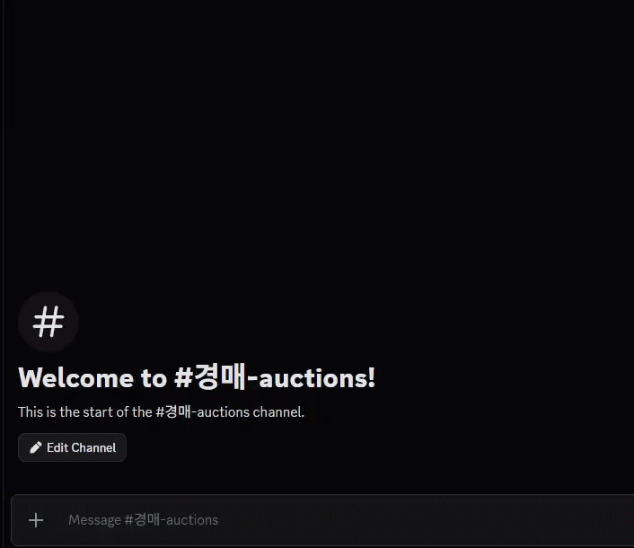
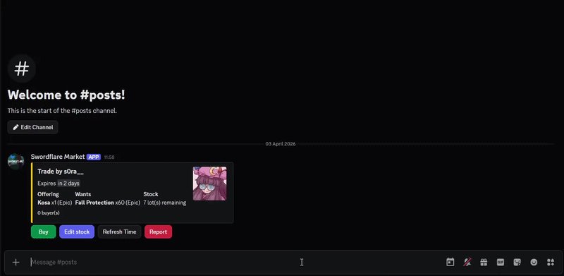

# Swordflare Market

  

### A Bot that makes trading much easier

### User commands:
> \<required> [optional] 

- `/new_trade`: **Posts a new trade request** 
Arguments:
  - `<item>`:           The item you're giving.
  - `[upgrade]`:        The number of upgrades of your given item.
  - `<amount>`:         The amount of items you're giving per trade.
  - `<wanted_item>`:    The item you want.
  - `[wanted_upgrade]`: The number of upgrades on your wanted item.
  - `<wanted_amount>`:  The amount of items you want.
  - `<stock>`:          How many items in stock you're willing to trade.
#### Example:

- `/new_auction`: **Posts a new auction** 
Arguments:
  - `<item>`:                   The item you're auctioning.
  - `[upgrade]`:                The number of upgrades on your auctioned item.
  - `<amount>`:                 The amount of auctioned items **at once**.
  - `<currency_item>`:          Your desired currency item (Fall Protection, Crystals, Other items...).
  - `[currency_item_upgrades]`: Your currency item's number of upgrades.
  - `<minimum_bid>`:            The minimum bid value.
  - `<time>`:                   How long until the auction ends (min: 1m, max: 48h).
#### Example:

- `/list_items`: **Lists all current tradeable items in game**
- `/set_language `: **Sets your preferred language** 
Arguments:
  - `<language>`

### Moderation Commands

#### Context Menu:
- `Blacklist User`:          Prevents the user from interacting with the Auctions and Trades, unless the user is an admin.

- `Unblacklist User`:        Removes a user from the blacklist.

- `List Reports`:            Lists all reports in a trade post (if any).
- `Mark Post as Invalid`:    Marks a trade/auction post as invalid (Immediately removes it from the database).

#### Slash Commands:
- `/list_blacklisted_users`: Lists everyone in the blacklist (10 entries per page).
- `/pause_bot`:              Pauses all commands and interactions (anti-raid feature).
- `/resume_bot`:             Resumes all commands and interactions
